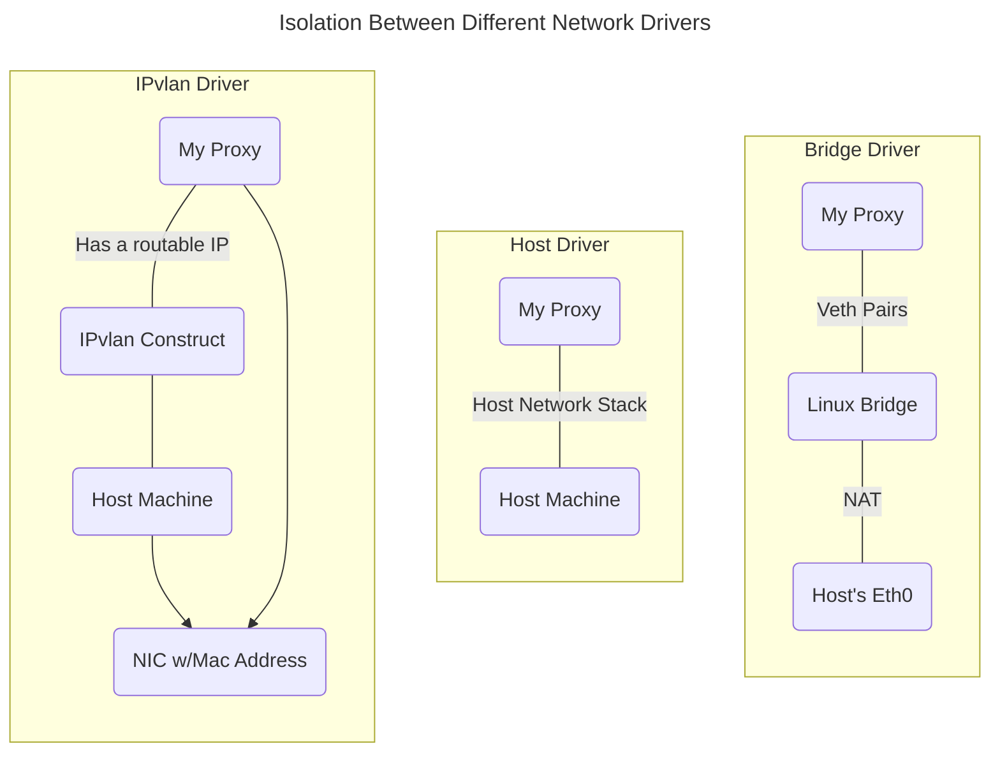
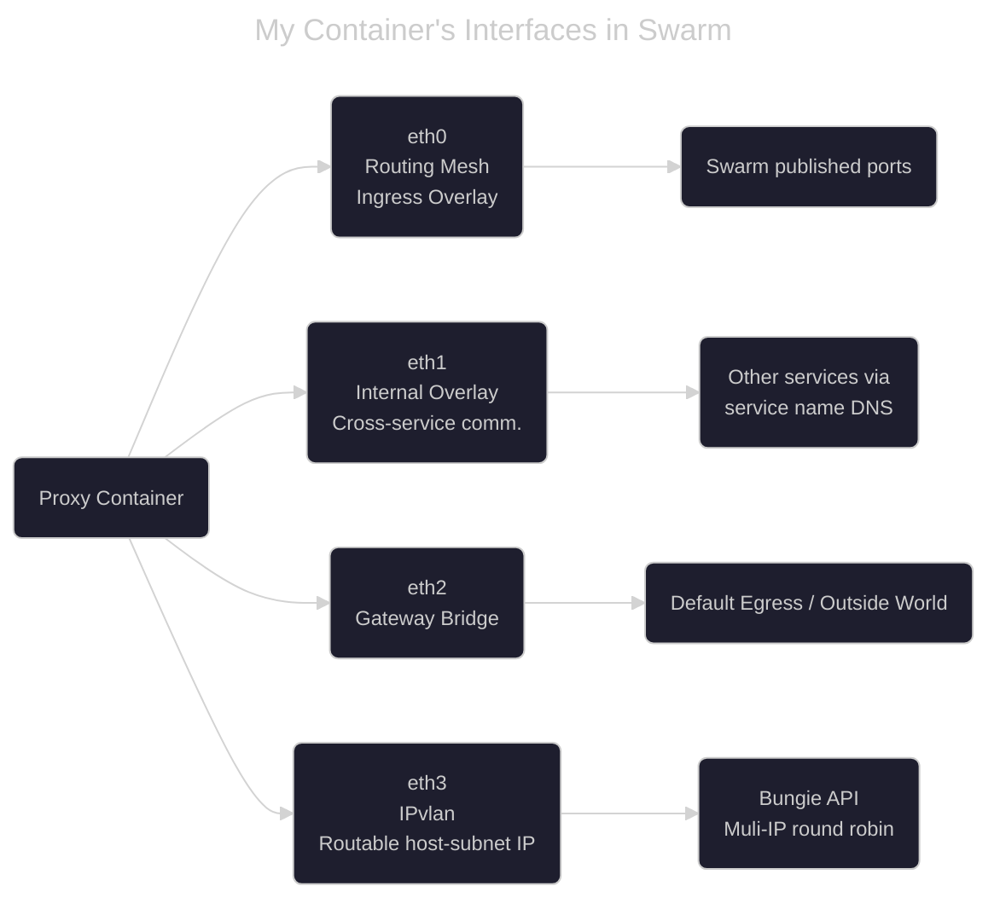

## Overview

While revisiting my [Rivenbot](https://github.com/riven-of-a-thousand-servers) project
I tried redeploying one quintessential part of it: the Rotating-Reverse Proxy.
Rivenbot tracks player activity for Destiny 2 and it aims to do so by having
access to real-time data. There are two reasons why the proxy exists: first,
my only source of that real-time data is a REST API exposed by Bungie (the
Destiny Devs) themselves, and second, Bungie's rate limits make it impossible
to keep up with the volume of data generated by active players using just a
single IP address. Using several IPv6 addresses lets me get around that. I did
confirm with the API devs beforehand that scraping with multiple IPs is fine
as long as I'm not abusing bandwidth, so no shady stuff here — just working
within the rules.

The proxy itself is very simple: It attaches to one of the network interfaces
(as long as that interface has routable, valid IPs), then round-robins through
the available IPs as requests come in, whole rate-limiting based on the target
URL's path and domain.

Deploying this as a standalone process on a single host would be trivial, but
I built Rivenbot entirely containerized, running across several machines with
Docker Swarm. To "just deploy the proxy on the host" wasn't really on the table.
To understand how IPvlan ended up solving this, it helps to understand what Docker
Swarm's Routing Mesh actually gives you, and why giving it up wasn't an option.

## Primer on Docker Swarm's Routing Mesh

Docker Swarm handles host/node service discovery and load-balancing through
[overlay networks](https://docs.docker.com/engine/network/drivers/overlay/).
Overlay networks let containers on different hosts talk to each other
as if they were on the same network, using a technology called VXLan.
Combined with gateway bridges created by Swarm on each node. Without this
bridge, a container on the overlay network would have no way to reach the
outside world. The overlay only handles container-to-container traffic
across different Swarm nodes. These two networks create a behavior called
the _Routing Mesh_. The routing mesh itself makes it easy for outside clients to
access Swarm services through their published ports without knowing specific IP
addresses and port combinations for any replicated services. It makes
it easy to access, for example, a web-server container replicated
three times across various hosts without the client knowing
a specific `[host:port]` combination.

Additionally, Swarm offers embedded
DNS resolutions for services running in the Swarm through their service name.
Instead of referring to Nginx by their IP address, you could make a request to
`http://nginx` and the DNS would resolve to the appropriate Nginx container.

> [!Note]
> Docker services **are not** the same as containers.
> Services are declarations made about the desired state of the cluster, usually
> in the form of properties in a YAML file.

This is a big oversimplification of how the routing mesh works, but hopefully
this gets the point across that this behavior simplifies headaches when
it comes to distributed networking and Docker containers. This is exactly
the convenience I wasn't willing to give up, which meant my original plan
for the proxy needed to go in the trash.

## The Problem with Host networking and Docker Swarm

My first instinct to solve my problem was to use Docker's [Host network driver](https://docs.docker.com/engine/network/drivers/host/)
so my proxy would have direct access to the host network stack and avoid any
container-networking shenanigans. However, there was a big
caveat to using this driver with Docker Swarm: Using it alongside
Docker Swarm bypasses the routing mesh behavior that gives me natural port publishing,
load balancing and DNS resolution across my services and my nodes. Since
the proxy itself only ran with one replica, port publishing and load
balancing was something I could live without. On the other hand,
DNS resolution was the one I wasn't willing to give up.
I wanted to have the convenience of calling my Swarm services by its service
name and have the cluster be able to resolve to the right container
seamlessly, including the proxy service. Here's what I landed on originally
by forcing host networking into Swarm:

```yaml
# docker-stack.yaml
services:
  proxy-service:
    image: rivenbot/proxy-service:${PROXY_SERVICE_VERSION:-latest}
    healthcheck:
      test: ["CMD", "curl", "-f", "http://localhost:8081/healthcheck"]
      interval: 10s
      timeout: 5s
      retries: 3
      start_period: 15s
    networks:
      - outside
    deploy:
      restart_policy:
        condition: on-failure
        delay: 5s
        max_attempts: 3
        window: 120s
      placement:
        constraints:
          - node.hostname==proxy-service-droplet
          - node.role==worker

# This is how you reference the host network
# from within a compose file
networks:
  outside:
    external:
      name: "host"
```

This was my original setup from months before I came back to continue the project;
and even though I got it working, something felt off enough that I opened a
[pull request in Docker Docs](https://github.com/docker/docs/pull/22724)
to see if this super niche compose configuration was worth documenting.
It wasn't approved. But the PR got rejected for a good reason — one
maintainer's response stuck with me: "This is not the intended use of Docker Swarm."
That's when it clicked that this wasn't the right approach to the problem.
It was the easy approach, but not the best one.

## Enter IPvlan

Months later, after some thorough research, very well-crafted prompts (not really),
I stumbled upon both the [IPVlan](https://docs.docker.com/engine/network/drivers/ipvlan)
and [Macvlan](https://docs.docker.com/engine/network/drivers/macvlan) network drivers.
They seemed like they could be exactly what I needed, but behind the layers of Linux's
abstractions and primitives, I honestly had no idea how they worked or how they'd
actually solve my problem.

So I sat down and actually studied how the IPvlan driver works. Turns out I had
to backtrack quite a bit before it clicked, since there were some gaps in my networking
fundamentals. I reviewed the Link Layer (Layer 2) and MAC addresses, since IPvlan's
whole trick revolves around how it handles addressing at that layer; Linux namespaces,
since that's how containers get their own isolated network view in the first place;
and Linux bridges, along with their parallel to Layer 2 switches and ethernet, since
that's the model IPvlan is deliberately breaking away from. Once those pieces were
in place, IPvlan's design finally made sense and so did the fact that it was exactly
what my proxy needed.

## What I discovered

The IPvlan Linux driver acts as a very lightweight middle-man
between the container and the host network. In comparison to other network drivers,
IPvlan and Macvlan blur the line on network isolation. The bridge driver, on the
other hand, completely isolates containers from the host. It acts like its own
miniature network switch (a Linux bridge) connected to each container via
virtual ethernet cables (veth pairs). In contrast, the host driver
offers very minimal isolation since the
container would share the same network stack as the host. Both IPvlan and
Macvlan sit as the middle-ground in comparison to host and bridge drivers.
The big trade-off for this is that both IPvlan and Macvlan are known as
"locally scoped" drivers, something that I'll talk about later.



IPvlan requires three things: an interface on the running host to attach to,
the host's subnet, and the host's gateway IP. Given these three parameters,
once you create and attach your container to the IPvlan network, two interesting
things happen:

1. The container gets a routable IP address from within the same CIDR block defined
   by the `gateway` and `subnet` parameters.
2. The IPvlan construct creates a network interface with the same MAC address
   as its parent's interface MAC address. This is how you know which interface
   inside the container belongs to your IPvlan network and its especially important
   in cloud environments, since sharing the parent's MAC address means the OS
   can demultiplex requests to the correct endpoint, in this case, your container.

There were some quirks too, based on how I'd originally configured my proxy.
My simple proxy relied on attaching to a statically-defined network interface
— `eth0` by default, back when it operated at the host's networking level. Adding
another network driver into the mix meant there was now an additional interface
it could bind to. So which one should it use? Previously, grabbing `eth0` was a safe
bet since it was the only real option. Now, with multiple interfaces in play, the
proxy has to figure out the right one dynamically instead.

Here's what the container's interfaces actually look like once IPvlan is in the picture:

1. Overlay network interface (routing mesh / ingress)
2. Internal overlay interface (cross-service communication)
3. Gateway bridge interface
4. IPvlan interface (the new one, with a routable host-subnet IP)



To figure out which one to use, the logic is simple: given the subnet
declared for the IPvlan network find the interface whose IP falls within that
subnet. Since the IPvlan driver always assigns the container's IP based on
the gateway and subnet specified at creation time.

Here's a snippet of code relevant to how I implemented dynamic interface discovery:

```go
  _, targetSubnet, err := net.ParseCIDR("<my_ipv6_subnet_cidr>")
  if err != nil {
      log.Fatalf("Unable to parse CIDR block: %v", err)
  }

  var ipv6interface string
Outer:
  for _, i := range interfaces {
      addresses, err := i.Addrs()
      if err != nil {
          log.Fatalf("Error reading addresses for interface %s: %v", i.Name, err)
      }
      for _, a := range addresses {
          ip, ok := a.(*net.IPNet)
          if !ok {
              log.Printf("Cannot assert type *net.IPNet from %T", a)
              continue
          }

          if targetSubnet.Contains(ip.IP) {
              ipv6interface = i.Name
              break Outer
          }
      }
  }
```

Additionally, in order to make effective use of my IPv6 addresses I have
to bind them to the same interface we discovered using the above snippet.
This one is also pretty straight-forward, I decided to use the `ip` utility
for assigning them to my container's `eth` interface as such:

```go
// ipv6n is a Go flag that defines how many IPv6 addresses to use
for range *ipv6n {
  cmd := exec.Command("ip", "-6", "addr", "add", fmt.Sprintf("%s/64", addr.String()), "dev", ipv6interface)

  if output, err := cmd.CombinedOutput(); err != nil {
    if *verbose {
        log.Printf("Failed to add IP %s: %v | Output: %s", addr.String(), err, string(output))
    }
  } else if *verbose {
    log.Printf("Successfully plumbed %s onto %s", addr.String(), ipv6interface)
  }

  // addr is incremented to the next IPv6 address in the pool here
}
```

## About Locally-Scoped Networks in Swarm

Technically speaking, both the Macvlan and IPvlan networks are what's
considered _locally-scoped_. That means their setup is tightly coupled
to a specific host, not just "a host somewhere in the cluster", but
the exact machine where the network was declared. Like we saw above,
creating an IPvlan network requires specifying a parent interface,
the gateway, and the subnet. All of which only make sense in the context
of one particular node's local network resources.

So what's the issue? I'm running a Docker Swarm cluster, and by default,
Swarm treats every Docker resource as swarm-scoped rather than
locally-scoped — meaning it expects to replicate that resource's
configuration across the entire cluster via Raft consensus,
so every node has a consistent view of it.

That's exactly where I got stuck (and it was an annoying one to debug).
My first attempt was just adding `--scope=swarm` directly to my
`docker network create` command, assuming that alone would make it
swarm-aware. I didn't work. Raft consensus is built around replicating
config that's valid cluster-wide. But an IPvlan network's config —
its parent interface, gateway, subnet — is only meaningful on the
one node where that interface actually exists. Trying to replicate
"use `eth0` as the parent" across every node doesn't make sense
when `eth0` might not even correspond to the same physical interface,
or even exist at all, on another machine.

The fix is to split network creation into two steps: first, create a
node-local "config-only" template on each node. This is a network
definition that isn't attached to any containers, it just describes
the local resources. Then, create the actual swarm-scoped network,
pointing it at the config template. Each node supplies its own version
of the config-only network, and Swarm uses whichever one is available
locally when the container on the node needs to attach.

> [!WARNING]
> If you do not do this step correctly then Docker WILL
> create an IPvlan network but without the passed-in options for
> the subnet, parent interface, and gateway address. A quick
> `docker network inspect` can help validate this if it ever
> happens to you.

First, creating the config-only network would look something like this:

```bash
docker network create -d ipvlan \
--subnet=<subnet_cidr> \
--gateway=<gateway_ip_address> \
-o parent=<local_interface> \
-o ipvlan_mode=l2 \
--config-only \
ipvlan-config
```

And finally, a Swarm-scoped IPvlan network from the previously declared
template:

```bash
docker network create -d ipvlan \
--scope=swarm \
--config-from ipvlan-config \
--attachable \
proxy-egress
```

## Wrapping Up

With the swarm-scoped IPvlan network finally configured correctly, the proxy
started picking up its dynamic IPv6 address and binding it without issue.
No more hardcoded `eth0`, no more fighting the routing mesh, and no more
rate-limit headaches from Bungie's API. Rivenbot's been running on this
setup since, quietly rotating through addresses in the background
exactly like it was supposed to from the start.

Looking back, the whole detour — host networking, the rejected PR, the
deep dive into Layer 2 fundamentals — probably could've been
skipped if I'd understood IPvlan's trade-offs from day one.
But that's usually how it goes: the easy approach gets tried first,
and it's not until it breaks (or a maintainer politely tells you it's wrong)
that the actual right approach even enters the picture.

There's still some manual work left I'd like to get rid of. Right now,
creating the config-only network on each node is something I run by
hand whenever a new node joins the cluster. Automating that as part
of node provisioning is next on the list. But for now, the proxy works,
the data keeps flowing, and that's good enough to call this one done.
