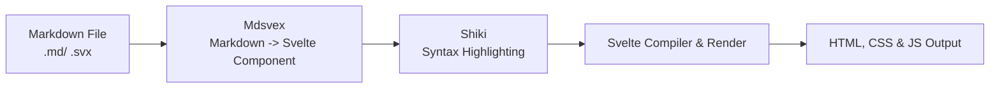
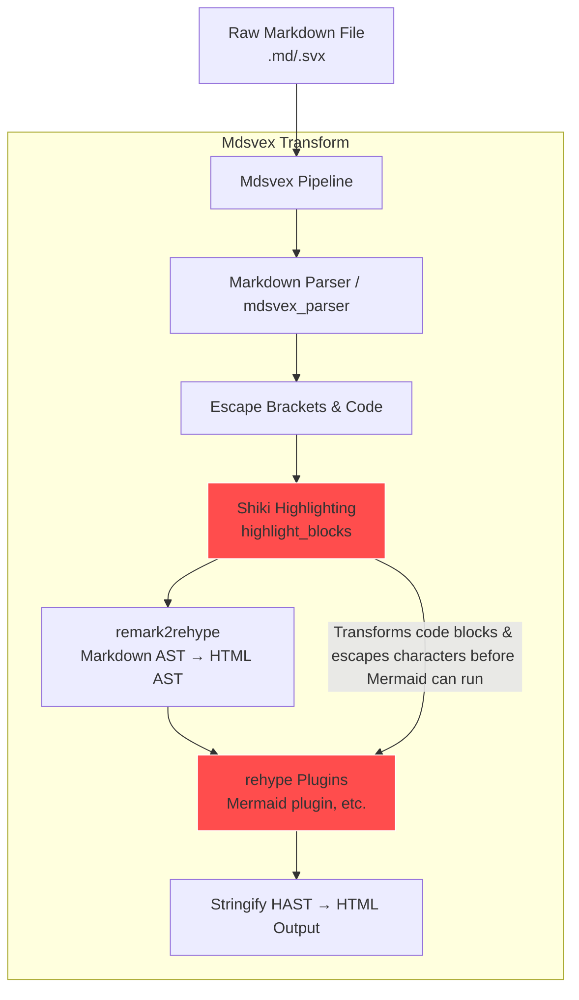

## Overview

When I built the blog section of my site and published my first post, I
knew I wanted to use flowcharts and sequence diagrams. Since the posts
are written in Markdown, [Mermaid](https://mermaid.js.org) was
the obvious choice, because it’s straightforward and rich for building
diagrams inside the markdown itself. But getting [Svelte](https://svelte.dev),
[Mdsvex](https://mdsvex.pngwn.io), [Shiki](https://shiki.style)
and Mermaid to play nicely together came with more
gotchas than I expected. In this post,
I’ll walk through the approach I settled on for integrating
Mermaid diagrams cleanly within a Svelte-based blog.

## The Existing Pipeline

At first glance, my setup looked very straightforward: markdown files
processed by Mdsvex, syntax highlighting on code blocks handled by Shiki,
Mermaid reads Mermaid-specific code and transforms it into a diagram, and
the result is rendered by Svelte. A more visual representation of this pipeline
is the following:



It felt reasonable to assume that a Mermaid
diagram defined in a triple-backtick code block would survive this pipeline intact.
In reality, the markdown goes through several transformations before it ever
reaches the browser.

Mdsvex first parses the markdown into an abstract syntax tree (AST) and compiles it
into a Svelte component. At this stage, fenced code blocks are no longer plain text;
they are structures nodes, just like headings and paragraphs. Before Svelte ever
renders anything, these code block nodes are handed off to Shiki for syntax highlighting.
Shiki replaces the original source text with generated HTML, typically a tree of
`<span>` elements with inline classes and style, and Mdsvex injects that output
using `{@html}`.

Once the content is compiled and rendered, Svelte adds its own internal hydration
markers to the output, regardless if the user decides to use server-side rendering
or not. These appear as HTML comment nodes `<!---->` and are used to track rendering
boundaries and updates. They are invisible in the browser, but they're still part
of the generated markup and DOM structure which you can see using the browser developer
tools.

By the time the page is delivered to the client, whether using server-side
rendering (ssr), client-side rendering (csr), or pre-rendering,
the diagram definition inside the Mermaid code block is no longer plain text.
It has been
heavily transformed into highlighted HTML and augmented with framework-level
markers. None of this is obvious when looking at the original Markdown file, but
it becomes critical when introducing a tool like Mermaid, which expects to
receive clean, unmodified text input.

## What Actually Broke

My initial assumption was that Mermaid diagrams would work out of the box by using
fenced markdown code blocks with the `mermaid` language identifier. This is a common
pattern in markdown-based tooling, and many static site generators support it directly
or via a small plugin. It felt like the simplest and most natural approach.

In practice, nothing happened.

The code block rendered as highlighted text, exaclty like any other language.
No diagram appeared, and no error was thrown. This failure was easy to
misinterpret as a missing initialization step or a configuration issue,
rather than a deep incompatibility in the rendering pipeline.

Part of the issue is that Mermaid makes specific assumptions about how its inpuit
is delivered. It expects either a container element with `language-mermaid` or `mermaid`
class, or direct access to the raw diagram defintion so it can parse
and render it itself. In this setup, neither condition was met. By
the time the code block reached the browser,
it had already been transformed into highlighted HTML by Shiki,
and the original text was no longer available in a form Mermaid could consume.

What looked like the simplest possible solution turned out not to be simple at all.
The problem wasn't that Mermaid failed to initialize, it was that the input Mermaid
requires never actually existed in the final output.

## Why Mdsvex Level Fixes Didn't Work

At this point, the problem wasn't Mermaid itself, but *where* Mermaid would
have to fit into Mdsvex's processing pipeline. Mdsvex builds on the
[unified](https://unifiedjs.com) ecosystem, running a series of Markdown and HTML
transformations before the content ever becomes a Svelte component. Each step
in that pipeline has side effects, and not all of them are reversible.

It's common to integrate Mermaid using a [Remark](https://github.com/remarkjs)
or [Rehype](https://github.com/rehypejs) plugin, so the initial instinct was to fix
the issue at the markdown level. In isolation, that approach makes sense: parse
the fenced code block, detect `mermaid`, and transform it into its SVG diagram.
In Mdsvex, however, that window closes much earlier than expected.

Here’s a simplified view of Mdsvex’s rendering pipeline.



The real constraint is the order of operations. Syntax highlighting via Shiki
runs early in Mdsvex's unified pipeline, before Remark or Rehype plugins can
meaningfully intervene. The source code for this pipeline can be found
[here](https://github.com/pngwn/MDsveX/blob/main/packages/mdsvex/src/index.ts).
Once Shiki processes a code block, the original source is gone. The markdown node
is replaced with generated HTML, injected using `{@html}`, and from that point on
the content is no longer Markdown or even plain text.

These transformations break Mermaids in two ways. First, Mermaid expects a clean,
textual diagram definition as input, not a tree of `<span>` elements and styles.
Second, character are semantically import to Mermaid such as `<`, `>`, and `|` are
escaped as part of the highlighting and HTML generation process. Even if the
diagram structure appears visually intact, its underlying text has been irreversably
altered.

At that point any attempt to process Mermaid at the Markdown or HTML level required
sacrificing Shiki entirely. Preventing highlighting for Mermaid blocks
would have meant entirely bypassing the highlighter or restructuring the
pipeline in a way, or even worse, requiring a change at the library level.
None of these options were acceptable.

This is why all the fixes at the pipeline-level failed. It wasn't
that Mermaid couldn't be parsed, it was that preserving Mermaid's raw
input conflicted directly with how the rest of the content was processed.
The pipeline could support highlighting, or it could support Mermaid,
but not both at the same stage. It was a **fundamental ordering conflict**.

## Letting Svelte Render Diagrams

My initial asssumption was that Mermaid diagrams should behave like normal
fenced code blocks. They look like code, they live in markdown, so treating
them like syntax-highlighted text felt natural. In an Mdsvex + Svelte setup,
that assumption broke very quickly.

Mdsvex lets you mix Markdown and Svelte freely, but everything eventually just
compiles down to plain HTML, CSS, and JavaScript. Once that happens, there's no
special meaning attached to a "code block" anymore. Just like when Shiki "highlights"
code, all it does is wrap parts of the text in `<span>`s. Mermaid
on the other hand, isn't static content, it needs to be run at runtime
and turn text into SVG.

The fix was mostly conceptual: diagrams don't belong in the markdown pipeline as
code. They belong in the Svelte layer as components. Once I treated Mermaid diagrams
as components instead of code blocks, the pipeline stopped fighting me.

## Rendering Mermaid Diagrams as Svelte Components

Instead of embedding Mermaid syntax inside fenced code blocks, the diagram definition
is passed directly to a component as plain-text via `$props`. This keeps the diagram
out of Mdsvex's highlighting and escaping stages, allowing Mermaid to run exactly
where I want it to.

In this case, the diagrams are rendered client-side at runtime.

Here's the `Mermaid` component:

``` svelte
// src/lib/components/Mermaid.svelte
<script lang="ts">
    import { onMount } from "svelte";
    import mermaid from "mermaid";

    let svg: string = $state("");

    let { code = "" } = $props();

    mermaid.initialize({ theme: "dark", startOnLoad: false })
    onMount(async () => {
	const id = `mermaid-${crypto.randomUUID}`;
	const { svg: output } = await mermaid.render(id, code);
	svg = output;
    })
</script>

<div class="container">
    {@html svg}
</div>
```

I intentionally avoid the `mermaid.run()` API here. That method scans the entire
document for elements with the `mermaid`-related clases and mutates the DOM globally,
which makes execution order fragile and difficult to reason about in a component-based
setup. Since each diagram is rendered in isolation, `mermaid.render()` is a better fit
since it produces a single SVG from a known input, with no global side effects.

As a result, the diagrams can be used directly inside `.md` files, without relying on
fenced code blocks at all:

``` markdown
// src/lib/posts/example.md

---
title: "This is an Example Article"
description: "Literally an example article"
date: "1999-30-07"
---

<script>
    import Mermaid from "$lib/components/Mermaid.svelte"
</script>

## Hello World!

Lorem Ipmsum Dolor sit amet...

<Mermaid code={`
    sequenceDiagram
    participant Master
    participant Worker
    Master->>Worker: Hello`
    }
/>
```

### Why Slots and Snippets Break Mermaid

It's tempting to pass Mermaid defintions using Svelte 5's slot mechanism that
utilizes the [snippets](https://svelte.dev/docs/svelte/snippet) and then
render them using `{@render children()}`. On the surface, this looks like a clean
way to keep diagrams inline with markdown content because, let's face it:
Passing the diagram definition via a prop looks odd. So initally my Mermaid
component used to look like this:

``` svelte
<script lang="ts">
	let rendered: boolean = $state(true);
	let { height = 400, children } = $props();
</script>

<div class="container" style:height>
	<pre class="mermaid">
		{@render children?.()} // allows slotting content
	</pre>
</div>

```

With this change then instead of passing the diagram definition via a prop
I could just wrap the text with my component cleanly like this:

``` svelte
<Mermaid>
sequenceDiagram
    participant Master
    participant Worker
    Master->>Worker: Hello
</Mermaid>
```

In partice however, this causes **subtle but frustrating failures**. Mermaid expects
**unmodified** text as input. Svelte's rendering model, however, does not
treat slot content as raw strings. During rendering and hydration, Svelte injects
internal markets into the DOM to track updates. These markers are invisible
in the browser but still exist as comment nodes (`<!---->`).

When slot content is rendered and then read back (especially
using `{@render children()}`), those hydration markers can end up
interleaved with the diagram text defintion.
From Mermaid's perspective, that's no longer valid syntax,
and it will actually not look correct visually. In my case, sequence
diagrams were working correctly but the last definition always
had an extra "\<!----\>" in the name. In the example above then,
the diagram definition would instead look like this from the browser tools:

``` svelte
<Mermaid>
sequenceDiagram
    participant Master
    participant Worker
    Master->>Worker: Hello
    \<\!----\>  // Poisoned input 
</Mermaid>
```

Passing the diagram definition as a plain string prop avoids this entirely. Props
exist as raw data, not rendered DOM content, which guarantees that Mermaid receives
clean and unaltered input every time. However, rendering Mermaid
diagrams through a Svelte component isn't free of compromises.

## Trade-offs of a Component-Based Approach

The most obvious limitation is that diagrams are now rendered **entirely client-side**.
Because Mermaid runs inside the `onMount()` function, no SVG is produced during
prerendering or server-side rendering. For most blogs this is acceptable because
the surrounding content is still static, but it does mean that diagrams won't appear
in the initial HTML for SEO.

There's also some clear loss of markdown ergonomics. Fenced code blocks are easy
to write, easy to read in markdown, and benefit from editor tooling and copy-pase
behavior. Replacing them with Svelte components is slightly more verbose and less
familiar, especially for long diagrams.

However, these trade-offs are intentional and the changes done to the markdown files
feel very idiomatic with Svelte. Treating them as components aligns better with how
they actually work and avoids brittle interactions with the markdown pipeline.
In exchange, this approach provides predictable rendering, avoids hydration issues,
and keeps diagram logic isolated from unrelated preprocessing steps like syntax
highlighting.

## When This Approach Makes Sense

This approach works best in content-heavy Svelte sites where diagrams are just
part of the presentation, not the primary payload. Blogs, documentation sites,
and personal knowledge bases are good example, especially when diagrams are used
to support an explanation rather than stand alone.

It also makes sense when you already rely on client-side JavaScript and are
comfortable trading some markdown ergonomics for predictable rendering. Is
best to not meddle too much with Mdsvex's rendering pipeline or Svelte's
preprocessors if you're not too comfortable with it. This isn't
a discouragement from exploring Svelte's internals, but a word of caution that
you can encounter subtle and frustrating bugs going down these paths, just like
I did. Nonetheless, the amount of learning done by dealing with these hardships
definitely add up to the collective knowledge I now have of Svelte.

Since this blog post was inspired due to my own hardships of getting Mermaid
to work in this blog, you can find the source code in my
[github repository](https://github.com/deahtstroke/verity-log) or you can
click on the "source" tab in the navigation bar above.
